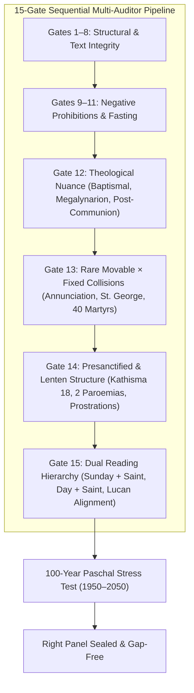

# Implementation Plan: Right Panel 15-Gate Exhaustive Verification & Sealing

This plan implements the final three validation gates (**Gates 13, 14, and 15**) in the sequential multi-auditor suite, resolves any uncovered edge-case collisions across movable and fixed calendar cycles, and executes a **100-year / multi-decade Paschal stress test** to mathematically guarantee that the **Right Panel (Typikon Rubrics)** is completely gap-free, canonically grounded in the 2010 Lviv Typikon and Dolnytsky Parts I–V, and sealed against regressions.

---

## User Review Required

> [!IMPORTANT]
> **Right Panel Identity Enforcement**: All outputs in the Right Panel remain strictly **Typikon Rubrics** (canonical *Ordo* / *Устав* directions: hymn counts, distribution ratios, tones, scriptural citations, vestment colors, and suppressions). They will **not** be bloated into continuous prayer text or full chant lyrics.

> [!NOTE]
> **Century Sweep Range**: The multi-auditor stress-test will run across **1950–2050 (101 years, ~36,890 calendar days, ~325,000 services)** to test all 35 possible Paschal date variations, leap-year shifts, and rare Holy Week / Bright Week feast collisions.

---

## Proposed Architecture & Changes



---

### Component 1: Multi-Auditor Engine (`scripts/service_day_multi_auditor.py`)

#### [MODIFY] [service_day_multi_auditor.py](file:///c:/Users/augus/OneDrive/Documents/Google%20Antigravity/Projects/Typikon%20Coded/scripts/service_day_multi_auditor.py)
* **Gate 13 (`gate13_rare_movable_fixed_collisions`)**:
  * **Annunciation (March 25)**:
    * *During Great Lent (Sundays 3, 4, 5)*: Asserts combined Sunday + Annunciation rubrics, festal stichera, and Liturgy of St. Basil.
    * *On Great Thursday (Pascha -3)*: Asserts Vesperal Liturgy of St. Basil with Annunciation readings.
    * *On Great Friday (Pascha -2)*: Asserts Great Vespers with Shroud + Vesperal Liturgy of St. John Chrysostom.
    * *On Great Saturday (Pascha -1)*: Asserts Vesperal Liturgy of St. Basil with 15 Old Testament readings + Annunciation additions.
    * *On Pascha Day (*Kyriopascha*, Pascha 0)*: Asserts Paschal Matins/Liturgy with combined Annunciation antiphons, troparia, and dual Gospels.
    * *During Bright Week (Pascha +1..+6)*: Asserts Paschal structure with Annunciation stichera and troparia.
  * **St. George (April 23)**:
    * When landing during Holy Week or Pascha Day, asserts canonical transfer to Bright Monday or Bright Tuesday according to Dolnytsky Part III.
  * **40 Martyrs of Sebaste (March 9) & Finding of the Head of the Baptist (Feb 24)**:
    * Asserts Presanctified Liturgy on weekdays, or Polyeleos + St. Basil Liturgy when falling on a Lenten Sunday.

* **Gate 14 (`gate14_presanctified_lenten_structure`)**:
  * On Presanctified Liturgy days (Wednesdays/Fridays of Great Lent, Thursday of Great Canon, Holy Mon/Tue/Wed):
    * Asserts **Kathisma 18** at Vespers.
    * Asserts **2 Old Testament Paroemias** (Genesis + Proverbs during Great Lent; Exodus + Job during Holy Week).
    * Asserts *"Let my prayer arise"* with prostrations.
    * Asserts Presanctified Communion Hymn (*"O taste and see that the Lord is good. Alleluia"*).

* **Gate 15 (`gate15_dual_reading_hierarchy`)**:
  * On combined days (Sunday + Polyeleos/Vigil Saint, Weekday + Polyeleos Saint):
    * Asserts dual **Prokeimena** (Sunday/Day first, Saint second).
    * Asserts dual **Epistle pericopes** (Sunday/Day first, Saint second).
    * Asserts dual **Alleluia verses** in appropriate tones.
    * Asserts dual **Gospel pericopes** (Sunday/Day first, Saint second).
    * Asserts that on Great Feasts of the Lord, the Feast readings stand alone without saint additions.

* **Auditor Pipeline Integration**:
  * Wire Gates 13, 14, and 15 into both `validate_single_service_booklet` and `validate_digest_card`.

---

### Component 2: Right Panel Formatters & Resolvers

#### [MODIFY] [digest/formatters/liturgy.py](file:///c:/Users/augus/OneDrive/Documents/Google%20Antigravity/Projects/Typikon%20Coded/digest/formatters/liturgy.py)
* Ensure dual readings (Prokeimena, Epistles, Alleluias, Gospels) are cleanly rendered in concise Typikon rubric format with their scriptural chapter/verse citations and tones.
* Ensure Presanctified Liturgy cards output exact canonical sequence (Kathisma 18, 2 Paroemias, *"Let my prayer arise"*, Communion *"Taste and see"*).

#### [MODIFY] [digest/formatters/lenten.py](file:///c:/Users/augus/OneDrive/Documents/Google%20Antigravity/Projects/Typikon%20Coded/digest/formatters/lenten.py)
* Enhance Lenten weekday Vespers and Matins cards to cleanly state Kathisma 18 assignments, Sessional hymn counts, and the Prayer of St. Ephrem with prostrations.

#### [MODIFY] [digest/base.py](file:///c:/Users/augus/OneDrive/Documents/Google%20Antigravity/Projects/Typikon%20Coded/digest/base.py)
* Ensure Annunciation collision scenarios (*Kyriopascha*, Great Friday Annunciation, Great Saturday Annunciation) generate flawless, concise Typikon rubric cards.

#### [MODIFY] [engine/resolvers/liturgy.py](file:///c:/Users/augus/OneDrive/Documents/Google%20Antigravity/Projects/Typikon%20Coded/engine/resolvers/liturgy.py)
* Ensure `resolve_liturgy_readings` and `resolve_liturgy_prokeimenon` accurately sequence dual pericopes across all historical dates.

---

## Verification Plan

### 1. Automated Unit & Integration Tests
* Run full pytest suite:
  ```powershell
  $env:PYTHONPATH="." ; .venv\Scripts\pytest --ignore=tests/test_ui_readability.py --verbose
  ```
* Run session compliance test:
  ```powershell
  $env:PYTHONPATH="." ; .venv\Scripts\pytest tests/test_session_compliance.py --verbose
  ```

### 2. Multi-Decade Century Paschal Stress Test (1950–2050)
* Execute the 15-Gate Multi-Auditor across **101 continuous years**:
  ```powershell
  $env:PYTHONPATH="." ; .venv\Scripts\python scripts/service_day_multi_auditor.py --start-date 1950-01-01 --end-date 2050-12-31
  ```
* Verify **0 errors across all ~36,890 calendar days and ~325,000 services**.

### 3. Post-Flight Checklist & Diff Audit (Master Rule 12)
* Run `git --no-pager diff --stat HEAD`.
* Verify pass counts and state the final verification metrics.