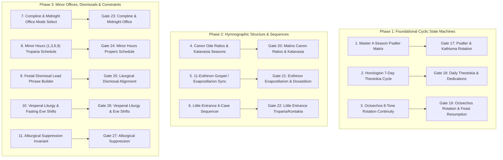

# Comprehensive Implementation Plan: Full Liturgical Cyclic Systems & Gates 17–27

Resolve all fundamental cyclic, hymnographic, and structural gaps in the engine by implementing the **canonical 4-season Psalter matrix**, **7-day Horologion theotokia cycles**, **canon ode ratios & katavasia seasons**, **6-case Little Entrance sequencer**, and expanding the multi-auditor from 16 to **27 automated validation gates** across the 100-year sweep.

---

## User Review & Guidance

> [!IMPORTANT]
> **Should you hold off on the Documentation Audit in the other chat?**
> **YES, HOLD OFF.** 
> Auditing documentation now while we are actively refactoring resolvers and adding Gates 17–27 would cause the documentation to immediately desynchronize again. Once this plan is executed and all 27 Gates pass across 100 years, the documentation audit can be executed against the final, immutable codebase.

> [!NOTE]
> **Is DeepSeek Needed?**
> The primary canonical source is already present in the workspace (`Data/Service Books/Typikon/readable_parts/Final_Dolnytsky_part1_structure.txt` through `part5_temple.txt` and `Ordo_Celebrationis_1996_CLEAN.md`). We do not need DeepSeek to invent rules, but we can utilize DeepSeek as a secondary check for complex canon distribution edge cases if needed.

---

## The 11 Core Systems & Missing Gate Map



---

## Proposed Changes

### Phase 1: Foundational Cyclic State Machines (Gates 17, 18, 19)

#### [NEW] `json_db/02h_logic_psalter.json`
- Master database encoding the 4 canonical Psalter schedules from Dolnytsky Part I §2 / Typikon Chapter 17:
  1. **Summer Schedule** (All Saints Sunday to Sept 21):
     * Sunday Matins: K2, K3 (+ Polyeleos / K17).
     * Mon Matins: K4, K5 | Mon Eve Vespers: K6.
     * Tue Matins: K7, K8 | Tue Eve Vespers: K9.
     * Wed Matins: K10, K11 | Wed Eve Vespers: K12.
     * Thu Matins: K13, K14 | Thu Eve Vespers: K15.
     * Fri Matins: K19, K20 | Fri Eve Vespers: K18.
     * Sat Matins: K16, K17 | Sat Eve Vespers: K1 (or None).
     * Sun Eve Vespers: None.
  2. **Winter Schedule** (Sept 22 to Dec 19; Jan 15 to Cheesefare):
     * 3 Matins Kathismata + Kathisma 18 at Vespers Monday–Friday.
  3. **Lenten Schedule** (Great Lent Weeks 1–6):
     * 3 Matins Kathismata + 1 Kathisma at 1st, 3rd, 6th, 9th Hours + Kathisma 18 at Vespers.
  4. **Paschal / Great Feast Suppression**:
     * Zero Kathisma throughout Bright Week and Great Feasts of the Lord.

#### [MODIFY] [`engine/resolvers/vespers.py`](file:///c:/Users/augus/OneDrive/Documents/Google%20Antigravity/Projects/Typikon%20Coded/engine/resolvers/vespers.py)
- Refactor `resolve_daily_kathisma` to query `json_db/02h_logic_psalter.json` based on the exact date and season, removing hardcoded `Kathisma 18`.

#### [MODIFY] [`engine/resolvers/matins.py`](file:///c:/Users/augus/OneDrive/Documents/Google%20Antigravity/Projects/Typikon%20Coded/engine/resolvers/matins.py)
- Refactor `resolve_matins_kathisma` and `resolve_polyeleos_or_kathisma_17` to read directly from `json_db/02h_logic_psalter.json`.

#### [MODIFY] [`engine/resolvers/hours.py`](file:///c:/Users/augus/OneDrive/Documents/Google%20Antigravity/Projects/Typikon%20Coded/engine/resolvers/hours.py)
- Refactor `resolve_kathisma` for 1st, 3rd, 6th, and 9th Hours to assign Lenten Kathismata according to the canonical Lenten distribution table.

---

### Phase 2: Hymnographic Structure & Sequences (Gates 20, 21, 22)

#### [MODIFY] [`engine/resolvers/liturgy.py`](file:///c:/Users/augus/OneDrive/Documents/Google%20Antigravity/Projects/Typikon%20Coded/engine/resolvers/liturgy.py)
- Implement `resolve_little_entrance_troparia_kontakia(context, rubrics)` covering all 6 canonical cases:
  * **Case 1 (Sunday with Feast of the Lord)**: Troparion of Feast, Kontakion of Feast.
  * **Case 2 (Sunday with Feast of the Theotokos)**: Troparion of Resurrection, Troparion of Feast; Glory: Kontakion of Sunday, Both now: Kontakion of Feast.
  * **Case 3 (Sunday with Polyeleos/Vigil Saint)**: Troparion of Resurrection, Troparion of Saint; Glory: Kontakion of Saint, Both now: Steadfast Protectress / Sunday Theotokion.
  * **Case 4 (Sunday with Simple Saint)**: Troparion of Resurrection; Glory: Kontakion of Saint, Both now: Steadfast Protectress.
  * **Case 5 (Weekday with Afterfeast)**: Troparion of Feast, Troparion of Saint; Glory: Kontakion of Saint, Both now: Kontakion of Feast.
  * **Case 6 (Saturday of the Dead)**: Troparion of All Saints, Troparion of the Departed; Glory: *With the saints give rest*, Both now: *To You, O Lord, the author of creation*.

#### [MODIFY] [`engine/resolvers/matins.py`](file:///c:/Users/augus/OneDrive/Documents/Google%20Antigravity/Projects/Typikon%20Coded/engine/resolvers/matins.py)
- Implement `resolve_canon_katavasia(context, rubrics)` mapping the seasonal Katavasia periods (*Cross*, *Nativity*, *Theophany*, *Meeting*, *Triodion*, *Pascha*).
- Implement `resolve_eothinon_hymnography(context)` strictly coupling the 11 Eothinon Gospels to their Exapostilaria and Gospel Stichera.

---

### Phase 3: Minor Offices, Dismissals & Multi-Auditor Gates (Gates 23–27)

#### [MODIFY] [`engine/resolvers/compline.py`](file:///c:/Users/augus/OneDrive/Documents/Google%20Antigravity/Projects/Typikon%20Coded/engine/resolvers/compline.py) & [`engine/resolvers/common.py`](file:///c:/Users/augus/OneDrive/Documents/Google%20Antigravity/Projects/Typikon%20Coded/engine/resolvers/common.py)
- Formalize Compline/Midnight Office selection logic and dismissal opening formulas.

#### [MODIFY] [`scripts/service_day_multi_auditor.py`](file:///c:/Users/augus/OneDrive/Documents/Google%20Antigravity/Projects/Typikon%20Coded/scripts/service_day_multi_auditor.py)
- Add **Gates 17 through 27**:
  * `gate17_psalter_kathisma_distribution`
  * `gate18_weekday_theotokia_cycle`
  * `gate19_octoechos_tone_rotation`
  * `gate20_matins_canon_katavasia`
  * `gate21_eothinon_exapostilarion_sync`
  * `gate22_little_entrance_sequence`
  * `gate23_compline_midnight_office`
  * `gate24_hours_propers_schedule`
  * `gate25_liturgical_dismissal_alignment`
  * `gate26_vesperal_liturgy_eve_shifts`
  * `gate27_aliturgical_suppression`

---

## Verification Plan

### Automated Tests
1. **Unit Test Suite**:
   ```powershell
   $env:PYTHONPATH="." ; .venv\Scripts\python -m pytest tests/test_psalter_matrix.py tests/test_little_entrance_sequence.py -v
   ```
2. **27-Gate Full 100-Year Multi-Audit (1950–2050)**:
   ```powershell
   $env:PYTHONPATH="." ; .venv\Scripts\python scripts/service_day_multi_auditor.py --start-date 1950-01-01 --end-date 2050-12-31
   ```
3. **Full Pytest Suite**:
   ```powershell
   $env:PYTHONPATH="." ; .venv\Scripts\python -m pytest --ignore=tests/test_ui_readability.py -v
   ```