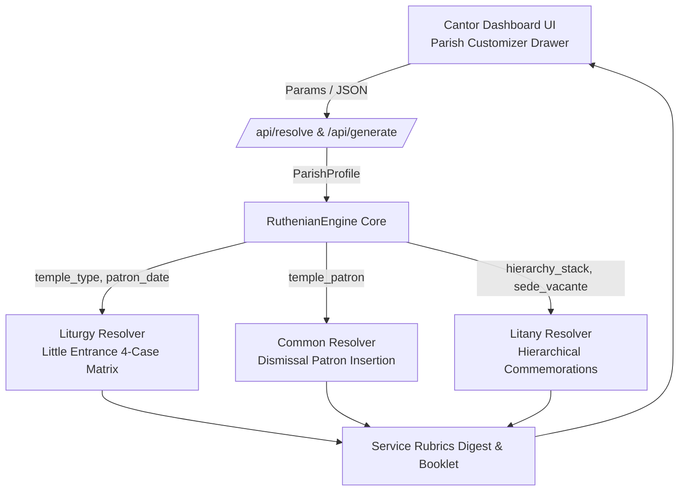

# Implementation Plan: Parish Customizer (Temple Patron & Hierarch Commemorations)

Dynamically adapt the **Typikon Coded Engine**, **Service Rubrics Digest**, and **Cantor Dashboard** to any specific parish temple dedication (Lord, Theotokos, Saint) and local hierarchical jurisdiction (Eparchy, Metropolia, Major Archeparchy, Sede Vacante).

---

## 1. Canonical Foundations & Authority Hierarchy

The system strictly implements the canonical rules of the Ruthenian / Ukrainian Greek Catholic Church:
* **Temple Little Entrance Precedence (4 Cases)**: *Ordo Celebrationis §§62–67; Dolnytsky Typikon Part V §1*.
* **Temple Patron Dismissal Invocations & Suppressions**: *Ordo Celebrationis §§99–104; Dolnytsky Typikon Part I (Dismissals)*.
* **Hierarchical Commemoration Stack & Sede Vacante Formulae**: *Ordo Celebrationis §§2251, 2334; Ruthenian Liturgicon (1989/2006)*.

---

## 2. Architecture & Data Structures



### A. Parish Profile Data Structure (`ParishProfile`)
```json
{
  "profile_id": "stamford_cathedral",
  "name": "Stamford — St. Vladimir Cathedral",
  "temple": {
    "name": "St. Vladimir the Great",
    "type": "saint",
    "feast_month": 7,
    "feast_day": 15,
    "troparion_key": "menaion.0715.troparion",
    "kontakion_key": "menaion.0715.kontakion",
    "dismissal_title": "holy equal-to-the-apostles Great Prince Vladimir"
  },
  "hierarchy": {
    "pope_name": "Francis",
    "pope_sede_vacante": false,
    "patriarch_title": "Major Archbishop",
    "patriarch_name": "Sviatoslav",
    "patriarch_sede_vacante": false,
    "metropolitan_name": "Borys",
    "metropolitan_sede_vacante": false,
    "bishop_name": "Paul",
    "bishop_sede_vacante": false
  }
}
```

### B. Standard Eparchial & Temple Presets Provided:
1. **Eparchial Presets**:
   * *Archeparchy of Philadelphia* (Metropolitan Borys)
   * *Eparchy of Stamford* (Bishop Paul)
   * *Eparchy of St. Nicholas in Chicago* (Bishop Benedict)
   * *Eparchy of St. Josaphat in Parma* (Bishop Bohdan)
   * *Eparchy of Toronto & Eastern Canada* (Bishop Bryan)
   * *Eparchy of Edmonton* (Bishop David)
   * *Custom / Independent Jurisdiction*
2. **Temple Dedication Presets**:
   * **Lord's Temples**: Holy Trinity, Holy Cross, Transfiguration, Holy Epiphany, Nativity of Christ, Ascension, Resurrection.
   * **Theotokos Temples**: Holy Protection (Pokrova), Dormition, Annunciation, Nativity of the Theotokos, Entrance of the Theotokos, Immaculate Conception.
   * **Saints / Angels Temples**: St. Nicholas, St. Michael the Archangel, St. John the Baptist, St. George, St. Demetrius, Holy Apostles Peter and Paul, St. Josaphat, St. Vladimir, St. Anne.

---

## 3. Detailed Proposed Changes

### Component 1: Engine Resolvers (`engine/`)

#### [MODIFY] [`engine/resolvers/liturgy.py`](file:///c:/Users/augus/OneDrive/Documents/Google%20Antigravity/Projects/Typikon%20Coded/engine/resolvers/liturgy.py)
* Refactor `resolve_liturgy_hymns(context, rubrics)` to implement the complete 4-Case Little Entrance Troparia and Kontakia ordering matrix based on `temple_type` (`"lord"`, `"theotokos"`, `"saint"`) and Feast Rank:
  * **Case 1 (Lord's Temple on Sunday)**: Sunday Troparion -> Saint Troparion -> Glory: Saint Kontakion -> Both now: Sunday Kontakion (or "Steadfast Protectress"). (Temple Troparion is omitted!).
  * **Case 2 (Theotokos Temple on Sunday)**: Sunday Troparion -> Temple Troparion of Theotokos -> Saint Troparion -> Glory: Saint Kontakion -> Both now: Temple Kontakion of Theotokos.
  * **Case 3 (Saint's Temple on Sunday)**: Sunday Troparion -> Saint Troparion -> Glory: Saint Kontakion -> Both now: "Steadfast Protectress of Christians" (or Sunday Kontakion).
  * **Case 4 (Great Feast of the Lord)**: Festal Troparion (1x) -> Glory.. now.. Festal Kontakion (1x). All other troparia/kontakia suppressed.
  * **Case 5 (Weekday in Lord's / Theotokos / Saint Temple)**: Day Theme Troparion -> Temple Troparion -> Saint Troparion -> Glory: Saint Kontakion -> Both now: Temple Kontakion (or "Steadfast Protectress").

#### [MODIFY] [`engine/resolvers/common.py`](file:///c:/Users/augus/OneDrive/Documents/Google%20Antigravity/Projects/Typikon%20Coded/engine/resolvers/common.py)
* Enhance `construct_dismissal(context, ...)`:
  * Check `temple.dismissal_title` or `temple.name`.
  * Insert: `"...and of holy [Dismissal Title], the patron of this holy temple..."` between the saint of the day and the final invocation, unless suppressed on Great Feasts of the Lord (*Ordo §101*).
* Enhance `resolve_litany_universal(context, litany_type)`:
  * Conjoin Pope, Patriarch/Major Archbishop, Metropolitan, and local Bishop names or substitute appropriate Sede Vacante phrases (*"the vacant Apostolic See of Rome"*, *"the administrator of our Eparchy"*).

---

### Component 2: Service Rubrics Digest Generator (`digest/`)

#### [MODIFY] [`digest/base.py`](file:///c:/Users/augus/OneDrive/Documents/Google%20Antigravity/Projects/Typikon%20Coded/digest/base.py)
* In `General Info Card`: Render parish metadata badge: `⛪ PARISH: [Temple Name] ([Dedication Type]) | EPARCHY: [Bishop Name]`.
* In `Divine Liturgy Card`: Dynamically generate the formatted Little Entrance table reflecting the active temple dedication, showing explicit troparion/kontakion titles and source keys.
* In `Dismissals`: Ensure the patron saint name appears explicitly in the dismissal rubric instructions.

---

### Component 3: Cantor Dashboard UI (`cantor_dashboard/`)

#### [MODIFY] [`cantor_dashboard/index.html`](file:///c:/Users/augus/OneDrive/Documents/Google%20Antigravity/Projects/Typikon%20Coded/cantor_dashboard/index.html)
* Expand the `⚙️ Liturgical Parameter Overrides` drawer with a dedicated **Parish & Temple Customizer** section:
  * **Eparchy Preset Selector**: Dropdown of canonical UGCC eparchies.
  * **Temple Dedication Selector**: Dropdown (`Lord's Temple`, `Theotokos Temple`, `Saint's Temple`).
  * **Temple Patron Feast**: Dropdown of common patronal feasts + custom date input.
  * **Hierarch Commemorations Drawer**: Nested accordion for custom Hierarch names and Sede Vacante checkboxes.
  * **Profile Management**: Save / Load / Delete named parish profiles with local storage persistence.

#### [MODIFY] [`cantor_dashboard/style.css`](file:///c:/Users/augus/OneDrive/Documents/Google%20Antigravity/Projects/Typikon%20Coded/cantor_dashboard/style.css)
* Add styling for parish badge headers, customizer grid, hierarchical inputs, and Sede Vacante toggle switches.

#### [MODIFY] [`cantor_dashboard/main.js`](file:///c:/Users/augus/OneDrive/Documents/Google%20Antigravity/Projects/Typikon%20Coded/cantor_dashboard/main.js)
* Hook up parish profile state, dropdown change events, local storage synchronization, and pass the structured `parish_profile` in the `/api/resolve` query.

#### [MODIFY] [`cantor_dashboard/server.py`](file:///c:/Users/augus/OneDrive/Documents/Google%20Antigravity/Projects/Typikon%20Coded/cantor_dashboard/server.py)
* Parse `parish_profile` from incoming request query / JSON payload and pass it to `RuthenianEngine` and the digest generator.

---

## 4. Verification Plan

### Automated Tests:
1. **Little Entrance 4-Case Matrix Unit Tests** (`tests/test_temple_little_entrance.py`):
   * Test Case A: Sunday in Lord's Temple (e.g. Holy Trinity) -> Temple Troparion omitted.
   * Test Case B: Sunday in Theotokos Temple (e.g. Protection) -> Temple Troparion & Kontakion included.
   * Test Case C: Sunday in Saint's Temple (e.g. St. Nicholas) -> Saint of the day + Steadfast Protectress.
   * Test Case D: Great Feast of the Lord (e.g. Theophany) -> Total suppression.
   * Test Case E: Weekday in Theotokos vs Saint Temple.
2. **Dismissal Patron Insertion Tests** (`tests/test_dismissal_resolution.py`):
   * Verify patron name insertion on ordinary days and suppression on Great Feasts of the Lord.
3. **Hierarchical Sede Vacante Tests** (`tests/test_hierarchical_commemorations.py`):
   * Verify papal, patriarchal, metropolitan, and eparchial sede vacante phrase substitutions in litanies.
4. **Server API Endpoint Tests** (`tests/test_server_endpoints.py`):
   * Verify `/api/resolve` with custom parish profile payload.
5. **Session Compliance & Full Test Suite**:
   * `.venv\Scripts\pytest tests/test_session_compliance.py --verbose`
   * `.venv\Scripts\pytest --ignore=tests/test_ui_readability.py --verbose`

### Manual Verification:
* Open Cantor Dashboard in browser (`http://localhost:8080`).
* Select different Temple Dedications (e.g., *St. Nicholas* vs. *Holy Protection* vs. *Holy Trinity*).
* Verify that the Little Entrance Troparia and Dismissals in the Service Rubrics Digest immediately update to reflect the selected temple!