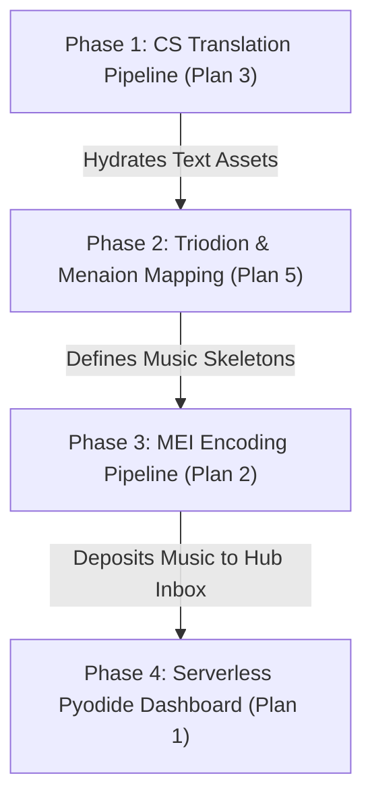

# Master Roadmap of Abandoned & Decoupled Plans

This document compiles the five implementation plans that were abandoned, deferred, or decoupled during previous sessions of the **Typikon Coded** ecosystem development. It reorganizes them into a unified roadmap, detailing their technical specifications, why they were halted, and how they would be executed if revived.

---

## Ecosystem Context: Hub-and-Spoke Architecture

To understand why these plans were shelved, they must be situated within the project's **Hub-and-Spoke** model:
*   **Typikon Coded (The Hub)**: Pure constraint-logic engine and Cantor Dashboard user interface.
*   **Translation, Revitalize, Kyivan Musicology (The Spokes)**: Independent data-ingestion factories that parse, translate, and structure texts or music, shipping them as JSON to the Hub's `Data/Inbox/` directory.

Several plans were abandoned to preserve this clean separation of concerns, keeping the Hub repo free from external ingestion scripts or heavy musicological pipelines.

---

## Plan 1: Serverless Pyodide Cantor Dashboard for GitHub Pages
*   **Context/Session**: `1960c5fd-a53e-4756-b23b-338dcf1f5c22` (June 12, 2026)
*   **Status**: Abandoned (Pivoted to layout drag-resize handles and local server stabilization).

### 1.1 Technical Objective
Transition the Cantor Dashboard from a dynamic Python backend server (`server.py`) to a client-side WebAssembly (Wasm) architecture using **Pyodide**. This enables hosting the dashboard as a static site on GitHub Pages with zero server overhead.

### 1.2 Proposed Changes
*   **[NEW] build_zip.py**: A script that bundles `engine/`, `typikon_digest_generator.py`, `json_db/`, and text assets into `assets.zip` (~1.5MB) and deposits it in `cantor_dashboard/`.
*   **[NEW] pyodide_api.py**: A mock backend layer packaged inside the zip file to translate javascript calls into Python engine API invocations (e.g. `resolve()`, `roadmap()`, `books()`, `text()`, `lint()`).
*   **[MODIFY] index.html**: Load Pyodide Wasm runtimes from CDN and implement a fullscreen loader screen (`#pyodide-loader-overlay`) to handle the initial boot time (1.5 to 3 seconds).
*   **[MODIFY] main.js**: Intercept all fetch requests (e.g., `/api/resolve`) and redirect them to run in the local Pyodide virtual filesystem interpreter instead of sending HTTP requests to the server.
*   **[NEW] .github/workflows/deploy.yml**: GitHub Actions workflow to automatically build `assets.zip` and deploy `cantor_dashboard/` to `gh-pages` branch on every git push.

### 1.3 Operational Barriers
*   **Initial Overhead**: Page load latency (downloading Wasm runtimes and asset zip files on cold start).
*   **Development Ergonomics**: Developers editing python logic files would have to rebuild the zip package after every change to test it in Wasm, introducing friction compared to a live-reloading python server.

---

## Plan 2: Exhaustive MEI (Music Encoding Initiative) Encoding Pipeline
*   **Context/Session**: `7ce03390-4223-46ca-b865-92f1f9d84385` (June 8, 2026)
*   **Status**: Decoupled (Moved to Kyivan Musicology Spoke to keep Hub logic-only).

### 2.1 Technical Objective
Build a processing pipeline that ingests raw JPG scans of historical 17th-century Kyivan Irmologions, extracts chant notation structures (syllables, neumes, pitches, staff coordinates) using a Vision API, compiles the data into MEI (Music Encoding Initiative) XML files, and ships them to the Hub inbox.

### 2.2 Proposed Changes
*   **[NEW] MEI_Tagging_Standard.md**: Semantic mapping specification defining how Kyivan notation features (e.g., C-clef on line 3, neume components like *kryuk* or *stola*) translate to MEI XML elements (`<meiHead>`, `<nc>`, `<syl>`).
*   **[NEW] mei_vision_extractor.py**: Python script that encodes manuscript scans to Base64, passes them to DeepSeek Vision APIs with custom prompt-framing, and outputs structured JSON matrices of pitches and lyrics.
*   **[NEW] mei_compiler.py**: Ingests JSON matrices and compiles them programmatically into schema-compliant nested MEI XML.
*   **[NEW] Handoff Pipeline**: Validates output XML against MEI schema, moves files to `Typikon Coded/Data/Inbox/`, and logs execution in `GLOBAL_ECOSYSTEM_STATE.md`.

### 2.3 Operational Barriers
*   **Vision Hallucinations**: Standard LLM Vision APIs lack structural training on 17th-century Kyivan square notation, leading to frequent pitch and rhythm transcription drift on degraded manuscript pages.

---

## Plan 3: DeepSeek Church Slavonic Translation Pipeline
*   **Context/Session**: `9ce8b88a-f79a-4d52-8247-ad7f5553fa86` (June 8, 2026)
*   **Status**: Decoupled (Managed as an independent Translation Spoke script).

### 3.1 Technical Objective
Create a batch translation script that ingests historical Church Slavonic PDF editions of the Octoechos, Triodion, and Menaion, executes translations using DeepSeek-V4-Pro's 1M token context, and outputs formatted JSON assets conforming to the Hub's flat-key text database schema.

### 3.2 Proposed Changes
*   **[NEW] deepseek_liturgical_translator.py**: Ingests text strings or base64 PDF pages, submits them to DeepSeek with vocabulary grounding rules (enforcing Stamford terminology), and extracts matching translation lists.
*   **[NEW] Incremental Persistence Caching**: Implements intermediate JSON chunk saving (`Translation/Final/`) to prevent data loss during network timeouts or rate limits on massive books.

### 3.3 Operational Barriers
*   **Vocabulary Calibration**: Enforcing stylistic consistency (e.g., pronoun capitalization, specific Galician translation variants) across different books required heavy prompt engineering and human post-editing.

---

## Plan 4: Automating the Yasinovsky Catalogue Translations (Wing A)
*   **Context/Session**: `6e0766d6-104a-45f3-971d-35be5aed5ba2` (June 10, 2026)
*   **Status**: Decoupled (Isolated strictly inside the Kyivan Musicology workspace).

### 4.1 Technical Objective
Automate the translation and markdown generation of 243 Yasinovsky catalogue manuscript description files from Ukrainian to English, extracting metadata properties (origins, dates, scripts) to generate JSON files conforming to the cataloging schema.

### 4.2 Proposed Changes
*   **[NEW] translate_catalogue_pipeline.py**: Scans files, determines translation differences between raw Ukrainian and English directories, executes translation prompts via Gemini API, and structures output into standard English Markdown templates with sigla filenames (e.g., `No. 410 - 1709 Lviv...`).
*   **[MODIFY] catalogue_validator.py**: Extends semantic checks to verify that translated file structures do not drift from the schema or introduce double-incipit lines.

### 4.3 Operational Barriers
*   **Rate Limits**: High concurrency translation of long academic descriptions risked hitting Gemini API `RESOURCE_EXHAUSTED` quotas without a robust batching-delay queue.

---

## Plan 5: Completing the Liturgical Cycle: Triodion & Menaion (Kyivan Chant)
*   **Context/Session**: `6c0e360c-a5fe-4584-b27f-a37488afa80c` (June 8, 2026)
*   **Status**: Abandoned (Initial queries did not yield a single comprehensive thesis, prompting a pivot to core engine compliance).

### 5.1 Technical Objective
Extract the structural mappings and melodic rubrics for Lenten Triodion, Pentecostarion, and Menaion chants from academic dissertation libraries, producing a structured mapping document to govern Kyivan music execution in the Hub.

### 5.2 Proposed Changes
*   **Data Gathering**: Scraping thesis databases (`er.ucu.edu.ua`) and digital archives (Vernadsky National Library) using boolean queries targeting Monody, Triodion, and Irmologion structures.
*   **[NEW] Liturgical_Cycle_Mapping.md**: Compiles extracted rubrical triggers and melody structures (under Jerusalem Typikon parameters) to define when specific chants are loaded in the Hub.

### 5.3 Operational Barriers
*   **Fragmented Research**: Academic resources are highly specialized (e.g., focusing on a single manuscript's history rather than mapping the entire Triodion cycle structurally), requiring manual musicological reconciliation.

---

## Unified Execution Roadmap

If these plans are revived, they should be implemented in the following logical sequence:

1.  **Phase 1 (Ingestion & Translation)**: Run Plan 3 (Church Slavonic Translation) to build out the English text libraries, feeding them to the Hub database.
2.  **Phase 2 (Liturgical Cycle Mapping)**: Execute Plan 5 to identify the structural chant rules for Lent and feasts, mapping them to logic triggers in the Hub.
3.  **Phase 3 (Music Encoding)**: Run Plan 2 (MEI Pipeline) to transcribe, compile, and ship Kyivan chant XML assets to the Hub based on the rules defined in Phase 2.
4.  **Phase 4 (Web assembly Porting)**: Execute Plan 1 (Pyodide Dashboard) to bundle the logic, text databases, and newly generated music files into a standalone, client-side Wasm dashboard hosted on GitHub Pages.
