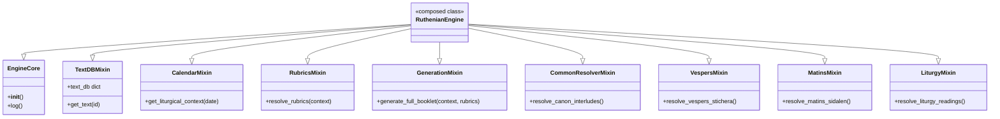

# Systems Architecture Guide: The Liturgical Intelligence Engine

The **Typikon Coded** engine (also known as the **Liturgical Intelligence Engine**) is a Byzantine Rite liturgical constraint-logic engine. It dynamically generates liturgical booklets and typikon directives according to the Lviv Recension (specifically the authoritative **Dolnytsky Typikon** of 1899/1904).

The engine is built on a strict **Logic-First** and **Asset-Agnostic** design philosophy. Liturgical state, rubrics, and structural constraints are calculated and resolved entirely before any textual assets are retrieved or formatting is applied. This separation ensures canonical accuracy and allows swapping textual translations or recensions (e.g., Stamford, Stamford 2014, Gregorian, or Julian calendars) without modifying the core processing code.

---

## 1. Core Architectural Principles

### A. Logic-First Resolution
The engine splits liturgical generation into two separate concerns:
1.  **Logical State & Rubrics**: Analyzing the date coordinates (Day of Week, Tone, Pascha Offset, Saint Ranks, and Moveable Cycle status) to identify which of the 20 authoritative Dolnytsky paradigms applies. The outcome is a structural set of rules (e.g., "We need 6 Stichera of the Octoechos in Tone 2 and 4 Stichera of the Saint from the Menaion").
2.  **Textual Hydration**: Retrieving the actual translation strings or chants matching the logical IDs generated in the first step.

### B. Asset Agnosticism & The Recension Layer
The Logic Engine resolves components to abstract **Logical IDs** (such as `stichera_resurrection_tone_2`). It has no hardcoded knowledge of english or slavonic text strings. The translation files map these logical IDs to physical assets.

```
+-------------------------------------------------------------+
|                     RuthenianEngine                         |
+-------------------------------------------------------------+
                              |
                     Resolves logical ID:
               "stichera_resurrection_tone_2"
                              |
                              v
+-------------------------------------------------------------+
|                       TextDBMixin                           |
+-------------------------------------------------------------+
                              |
             Routes to active Recension Folder:
                       "json_db/stamford/"
                              |
                              v
+-------------------------------------------------------------+
|       "json_db/stamford/text_octoechos.json"                |
|  Maps "stichera_resurrection_tone_2" -> "When You arose..." |
+-------------------------------------------------------------+
```

This dual-path design allows loading proprietary or alternative translations dynamically via `fixed_recension_path` and `variable_recension_path` configurations at startup.

### C. Strict Hierarchical Overrides
Liturgical variables are resolved by overlaying cyclic data layers, matching the canonical hierarchy of the Eastern Church:
*   **Layer 1: Universal Cycle (Octoechos)**: Weekly tone and daily theme rotation (lowest priority).
*   **Layer 2: Fixed Cycle (Menaion)**: Fixed dates (saints, feasts of the saints, calendar events).
*   **Layer 3: Dynamic Cycle (Triodion & Pentecostarion)**: Movable seasons centered around Pascha (highest priority, overrides Layer 1 and Layer 2).
*   **Layer 4: Local Temple Customs (Typika/Temple Feasts)**: Specific local variables applied to default paradigms.

---

## 2. The Mixin Framework Composition

The [RuthenianEngine](file:///c:/Users/augus/OneDrive/Documents/Google%20Antigravity/Projects/Typikon%20Coded/engine/__init__.py#L29-L45) class does not exist as a single monolithic block of code. Instead, it utilizes Python's multiple-inheritance mixin architecture to compose distinct domain sub-systems into a unified API.



### Mixin Component Map
*   [EngineCore](file:///c:/Users/augus/OneDrive/Documents/Google%20Antigravity/Projects/Typikon%20Coded/engine/core.py#L34): Core initialization, registry setups, and filesystem logic.
*   [TextDBMixin](file:///c:/Users/augus/OneDrive/Documents/Google%20Antigravity/Projects/Typikon%20Coded/engine/text_db.py): Handles loading recension directories, merging text files, and mapping logical IDs.
*   [CalendarMixin](file:///c:/Users/augus/OneDrive/Documents/Google%20Antigravity/Projects/Typikon%20Coded/engine/calendar.py): Computes dates, movable Pascha offsets, and basic cycle variables.
*   [RubricsMixin](file:///c:/Users/augus/OneDrive/Documents/Google%20Antigravity/Projects/Typikon%20Coded/engine/rubrics.py): The decision engine matching the active context to the master paradigms.
*   [GenerationMixin](file:///c:/Users/augus/OneDrive/Documents/Google%20Antigravity/Projects/Typikon%20Coded/engine/generation.py): Executes structure expansion and compiles the final booklet or typikon digest.
*   **Resolver Mixins**: Individual modules containing target functions for specific services (Vespers, Matins, Liturgy, Hours, Compline, Lenten, Paschal).

---

## 3. The 5-Step Generation Pipeline

The generation process executes a linear 5-step pipeline:

```
[Date Input]
     |
     v
+-----------------------------------------------------------------------------+
| Step 1: Context Resolution (CalendarMixin.get_liturgical_context)           |
| - Calculates Pascha offset, Day of Week, Eothinon number, and Active Tone.   |
+-----------------------------------------------------------------------------+
     |
     v
+-----------------------------------------------------------------------------+
| Step 2: Rubric & Paradigm Resolution (RubricsMixin.resolve_rubrics)         |
| - Interviews the day parameters against 02a_logic_general.json (Paradigms)  |
| - Merges Triodion overrides (02c_logic_triodion.json) and saint data.        |
+-----------------------------------------------------------------------------+
     |
     v
+-----------------------------------------------------------------------------+
| Step 3: Structure Expansion (GenerationMixin.generate_full_booklet)         |
| - Loads skeletal service structures (e.g. 01h_struct_vespers.json).         |
| - Resolves structure inheritance and applies action overrides.              |
+-----------------------------------------------------------------------------+
     |
     v
+-----------------------------------------------------------------------------+
| Step 4: Slot Resolution & Dynamic Execution (GenerationMixin._resolve_slot) |
| - Executes target resolver functions for variable logic slots.             |
| - Validates allowed execution routes against the ResolverRegistry.          |
+-----------------------------------------------------------------------------+
     |
     v
+-----------------------------------------------------------------------------+
| Step 5: Text Retrieval & Booklet Assembly                                    |
| - Replaces resolved logical component IDs with translation texts.           |
| - Formats and compiles output booklet (Markdown, JSON).                     |
+-----------------------------------------------------------------------------+
```

### Lifecycle Walkthrough

#### Step 1: Context Resolution
The entry point passes a Gregorian date (e.g. `2026-06-14`). The engine calculates:
*   `pascha_offset`: Difference in days from the calculated Paschal Sunday (e.g., `+63` days = Sunday of the All Saints).
*   `octoechos_tone`: Tone of the week (derived from the Paschal cycle).
*   `day_of_week`: Sunday (0) through Saturday (6).
*   `saints`: Loaded saint records for June 14 from the Menaion database.

#### Step 2: Rubric Resolution
The resolved context is analyzed. The engine matches it to one of the **20 Paradigms** in `02a_logic_general.json`:
*   *Example*: Sunday overlapping a Polyeleos Saint (rank 3).
*   The system loads the paradigm's default variables (e.g. `vespers_type = "great_vespers_vigil"`, `matins_type = "daily_matins"`) and executes the collision overrides to resolve final variables and overrides.

#### Step 3: Structure Expansion
The engine processes each service in the `daily_cycle` list. It loads the skeleton schema (e.g. `01h_struct_vespers.json`) matching the resolved `root_id` (e.g. `great_vespers_vigil`). 
*   It calls `_get_structure_sequence`, which recursively processes any `inherits_from` properties and applies sequence modifications (`replace`, `delete`, `insert_before`, `insert_after`, `modify`) defined in the structure overrides.
*   Nested sub-skeletons (e.g. litanies or blessings) are expanded inline if a slot has a `type: "link"` definition.

#### Step 4: Slot Resolution & Dynamic Execution
The expanded sequence is processed slot-by-slot. For slots of `type: "variable_logic"`, the engine looks up the target function (e.g. `resolve_vespers_stichera`) in the mixins and executes it:
*   Before execution, the function is validated against the [ResolverRegistry](file:///c:/Users/augus/OneDrive/Documents/Google%20Antigravity/Projects/Typikon%20Coded/engine/resolver_registry.py#L5) to ensure it is registered and permitted for the active service structure.
*   The function runs and returns a set of logical elements (such as `{"type": "stichera", "id": "stichera_resurrection_tone_2_1"}`).

#### Step 5: Text Retrieval & Booklet Assembly
The engine iterates over the final array of components. For every `fixed_ref` slot and logic result, it queries the `TextDBMixin`:
*   If found, it hydrates the slot with the exact text content from the loaded JSON dictionaries (e.g., `text_octoechos.json` or `text_triodion.json`).
*   If missing, it places an explicit warning indicator (`[MISSING_COMPONENT: id]`), allowing debugging without crashing execution.
*   The hydrated blocks are merged into the final output booklet.

---

## 4. Key Code Design Patterns

### A. Decorator-Based Source Grounding
To maintain canonical precision and prevent deviations from authoritative rubrics, the codebase uses a custom `@liturgical_source` decorator defined in [core.py](file:///c:/Users/augus/OneDrive/Documents/Google%20Antigravity/Projects/Typikon%20Coded/engine/core.py#L15).

```python
@liturgical_source(
    dolnytsky="Final_Dolnytsky_part1_structure.txt:L187",
    ordo="Ordo Celebrationis (1996) L74"
)
def resolve_canon_interludes(self, ode_number, context):
    # logic execution...
```
This forces all logic functions to document their exact textual source grounding inside the Lviv Recension (Dolnytsky) and Rome Recension (Ordo Celebrationis) guides.

### B. Execution Safety via ResolverRegistry
To prevent code fragility and ensure structural consistency, the [ResolverRegistry](file:///c:/Users/augus/OneDrive/Documents/Google%20Antigravity/Projects/Typikon%20Coded/engine/resolver_registry.py#L5) pre-compiles a list of allowed logic resolvers for each service structure.
*   It dynamically scans all structural JSON schemas at startup.
*   If a JSON structure attempts to execute a resolver function that is not linked or inherited in the structure's blueprint, the registry flags it, preventing runtime logic contamination across services.

