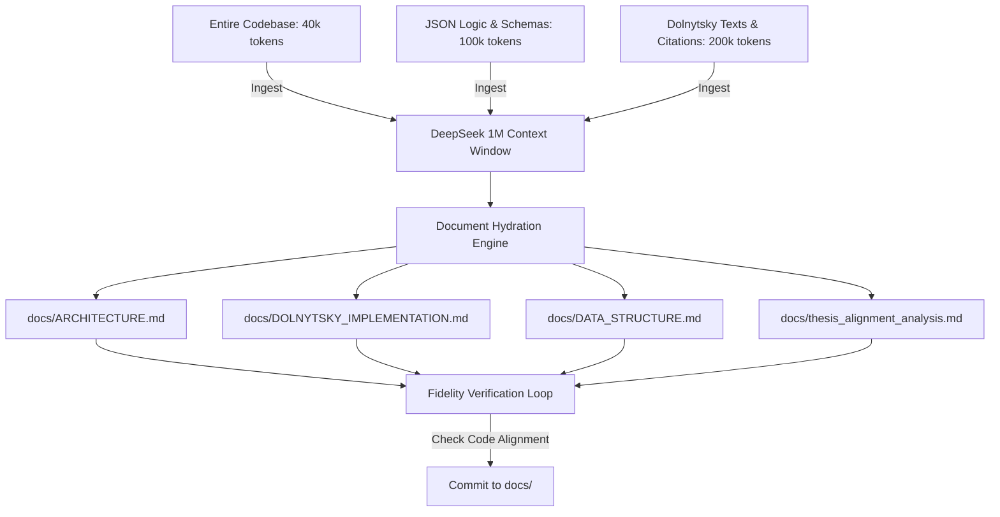

# DeepSeek 1M Context Documentation Expansion Strategy

This document details how to leverage DeepSeek (specifically V4 Pro API with up to 1M context window) to systematically expand the **Typikon Coded** project documentation into a top-tier, authoritative, and exhaustive resource.

---

## 1. The Context Window Advantage (1M Tokens)

DeepSeek's 1M context window allows us to bypass the traditional limitations of retrieval-augmented generation (RAG)—namely, loss of structure, lack of holistic domain context, and fragmented responses. 

For the **Typikon Coded** engine:
*   **Total Codebase Volume**: The core Python resolvers (`matins.py`, `vespers.py`, `liturgy.py`, `hours.py`, `common.py`), utility classes, database models, and the testing suite total approximately **40,000 tokens**.
*   **Asset Database Volume**: The database configuration files (`02a_logic_general.json`, `02c_logic_triodion.json`, etc.) and the schema JSONs total approximately **100,000 tokens**.
*   **Authoritative Sources**: The raw Dolnytsky translation drafts, academic comparisons, and historical citation matrices total approximately **200,000 tokens**.

Combined, the entire project workspace is around **340,000 tokens**. This means **the entire project can fit into a single DeepSeek context window** with over **650,000 tokens remaining** for reasoning, generation, and cross-referencing.

---

## 2. Structured Ingestion Pipeline

To generate accurate, thorough, and top-tier documentation, we avoid "one-shot" summaries. Instead, we use a structured hydration pipeline where DeepSeek is prompted with the entire codebase as a baseline and asked to systematically expand individual documentation files.

---

## 3. Targeted Document Hydration Plans

Each document will be expanded using a dedicated context prompt designed to achieve maximum depth and complete technical coverage.

### A. [ARCHITECTURE.md](file:///c:/Users/augus/OneDrive/Documents/Google%20Antigravity/Projects/Typikon%20Coded/docs/ARCHITECTURE.md) (System Architecture)
*   **Focus**: A comprehensive technical reference of the engine's processing pipeline, state machine, and override layers.
*   **DeepSeek Task**: 
    1. Ingest all python files under `engine/` and `engine/resolvers/`.
    2. Document every key class (e.g., `RuthenianEngine`, `CommonResolverMixin`, `MatinsResolver`) and their exact lifecycle methods.
    3. Graph and explain the complete flow of a service generation request: from date/tone lookup, through paradigm case-matching, dynamic slot expansion, down to raw text lookup.
    4. Detail the decorator logic (`@liturgical_source`) and how source citations are tracked throughout the evaluation tree.

### B. [DOLNYTSKY_IMPLEMENTATION.md](file:///c:/Users/augus/OneDrive/Documents/Google%20Antigravity/Projects/Typikon%20Coded/docs/DOLNYTSKY_IMPLEMENTATION.md) (Canonical Logic Reference)
*   **Focus**: The definitive manual of the 20 Paradigms, the "Weighing of Feasts" algorithms, and precedence mechanics.
*   **DeepSeek Task**:
    1. Ingest `02a_logic_general.json`, `02c_logic_triodion.json`, and `engine/calendar.py`.
    2. Write an exhaustive chapter for each of the **20 Paradigms** (e.g., Sunday Simple, Sunday Polyeleos Saint, Great Feast of the Lord).
    3. For each paradigm, document:
        - The exact logical conditions (Date, Day of Week, Feast Rank, Moveable Cycle status) that trigger it.
        - The combined structure (how Octoechos, Menaion, and Triodion/Pentecostarion slots are split and interleaved).
        - The detailed script execution flow (e.g., Kontakion Shift, Kathisma rotations, dismissal selections).
    4. Provide clear mathematical models of the collision precedence algorithms (e.g., how the system weighs a Sunday against a Saint with Vigil).

### C. [DATA_STRUCTURE.md](file:///c:/Users/augus/OneDrive/Documents/Google%20Antigravity/Projects/Typikon%20Coded/docs/DATA_STRUCTURE.md) (Schema & Asset Reference)
*   **Focus**: A strict, production-ready schema specification for all JSON assets, databases, and variables.
*   **DeepSeek Task**:
    1. Ingest all files in `schemas/` and the JSON assets under `json_db/`.
    2. Define every asset type (`hymn`, `stichera`, `canon`, `sessional`, `dismissal`) with its JSON representation, mandatory fields, optional metadata, and type-constraints.
    3. Document the complete schema for the `Context` object, showing how date coordinates map to liturgical variables.
    4. Provide annotated examples of complex logic JSON blocks (e.g., dynamic conditional templates, slot ratios, and variable override maps).

### D. [thesis_alignment_analysis.md](file:///c:/Users/augus/OneDrive/Documents/Google%20Antigravity/Projects/Typikon%20Coded/docs/thesis_alignment_analysis.md) (Academic Compliance)
*   **Focus**: Academic grounding, verification of master alignment tests, and compliance with the 2011 Thesis *"Automating the Byzantine Typikon"*.
*   **DeepSeek Task**:
    1. Ingest the text of the Master's Thesis and `tests/test_master_alignment.py`.
    2. Detail the exact mathematical differences and similarities in the core state space representations.
    3. Compare the thesis's Prolog-based implementation approach with this engine's JSON/Python paradigm-based approach.
    4. Prove that every compliance case (such as the double-readings constraints, isodikon variations, and canon structures) aligns with the thesis parameters.

---

## 4. The Fidelity Verification Loop (Anti-Hallucination)

A primary risk in LLM-generated documentation is the creation of plausible-sounding but technically inaccurate statements (hallucinations of function names, JSON keys, or canonical rules). 

To eliminate this, we implement a **Double-Pass Verification Prompt**:

1.  **Pass 1 (Drafting)**: DeepSeek generates the expanded document section-by-section.
2.  **Pass 2 (Verification)**: We feed the draft back to DeepSeek along with the codebase and ask:
    > *"Analyze the generated draft against the codebase. For every function name, class name, JSON path, and canonical reference, verify that it matches the source code exactly. If there is any discrepancy, generate a correction diff block. If a code function does not exist, flag it as a hallucination."*
3.  **Refinement**: Apply the corrections automatically before committing to the repository.

---

## 5. Implementation Roadmap

We will tackle the documentation expansion in four sequential phases:

| Phase | Target Document | Ingestion Context | Expected Length |
| :--- | :--- | :--- | :--- |
| **Phase 1** | `ARCHITECTURE.md` | Engine source code, decorators, config files. | ~500 lines |
| **Phase 2** | `DOLNYTSKY_IMPLEMENTATION.md` | JSON logic files, `calendar.py`, `resolvers/`. | ~1,000 lines |
| **Phase 3** | `DATA_STRUCTURE.md` | JSON database assets, schema files. | ~600 lines |
| **Phase 4** | `thesis_alignment_analysis.md`| Test suites, raw academic papers. | ~800 lines |
